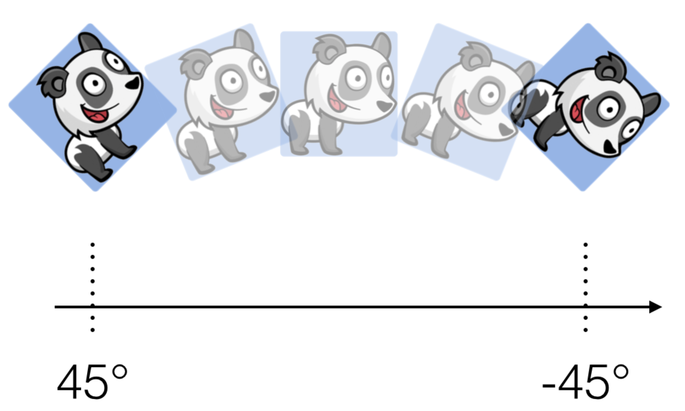
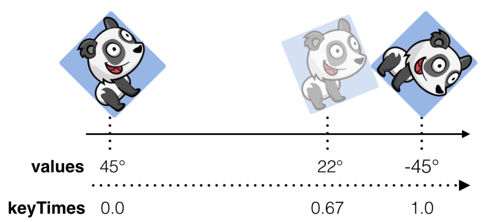

# Section 4 : Layer Animations

### 1.View和Layer的区别

关于layer的相关介绍：

- Layer是一个model object, 他暴露一些数据属性，但是它不实现具体的业务逻辑。而且，它不支持Auto Layout,  也不响应用户交互。

- Layer拥有可见的预先定义的特点。这些特点实际上就是一些``data properties``，这些属性会直接影响到layer在屏幕上的具体渲染， 例如我们常见的border, borderColor, borderWidth, cornerRadius以及shadows。

- Core Animation可以优化layer content的缓存内容，并且可以直接通过GPU进行渲染。


关于View的描述：

- View用于复杂的图层结构，Auto layouts。

- View可响应用户交互。

- View支持自定义视图，同事支持自定draw code（自定义绘制内容）。

- View非常灵活，支持面向对象特性， 拥有强大的API, 他是大量UI component的父类。


关于Layer的描述：

- 简单的层次结构，快速的构建布局，快速的绘制（可缓存到GPU上， 进行快速渲）。

- 没有响应链（这个响应链就是用户交互动作的响响应链， UIResponder）。

- 不支持逻辑自定义，直接通过GPU渲染在屏幕上。

- 显贵而言不怎么灵活，切子类也比较少。


## Chapter 10: Getting Started with Layer Animations

### Animatable properties

1.**Position and size**

- bounds: 修改layer的bounds属性，可对其绑定的frame层添加动画效果。

- position: 修改layer的postion属性，可让其在其父layer的中位置移动，具有动画效果。如果我们只希望其在某个坐标轴上移动，我们也可以单独去修改position.x或者是position.y。

- transform: 修改layer的transform属性，我们可对其添加移动，缩放和旋转的动画效果。我们甚至可以对其添加3D动画效果。注意，我们不能给view单独添加3D效果，这是也是layer和view的区别之一。

**2.Border**

我们可用对layer的border属性添加动画效果，我们可以对border的颜色，宽度， 圆角等，添加动画效果。

- borderColor: 边框颜色。

- borderRadius: 圆角弧度。

- borderWidth: 边框宽度。

**3.Shadow**

我们可以对layer的所有方向的阴影添加动画效果。

- shadowOffset: 修改layer.shadowOffset属性, 可以调整阴影距离原图层的远近。

- shadowOpacity: 修改layer.shadowOpacity属性，可以调整阴影的淡入或淡出。

- shadowPath: 修改layer.shawdowPath属性，我们可以调整layer阴影的形状。我们还可以创建不同的3D效果，使layer的阴影具有不同形状和位置的浮动。

- shadowRadius: 修改layer.shawdowRadius属性，我们可以调整layer的阴影的模糊程度。该属性在模拟视线朝向或远离投射阴影的表面时特别有用。

**4.Contents**

最后我们来看几个控制layer内容如何渲染的属性：

contents: 修改该属性来分配原始TIFF或PNG数据作为层内容。

mask: 修改该属性，我们可以确定layer的可视内容的装饰的形状或图像。我们可以利用该属性来实现一些非常炫酷的动画效果。

5.opacity: 修改该属性，可以控制layer可视内容的透明度。

备注: 以上所以的属性，只是layer可动画属性的一部分，CALayer的子类， 还定义了很多其他可动画的属性。


### CAMediaTimingFillMode

下面我们来介绍下`CAMediaTimingFillMode`的部分扩展属性，源码如下：

```swift
extension CAMediaTimingFillMode {

    @available(iOS 2.0, *)
    public static let forwards: CAMediaTimingFillMode

    
    @available(iOS 2.0, *)
    public static let backwards: CAMediaTimingFillMode

    
    @available(iOS 2.0, *)
    public static let both: CAMediaTimingFillMode

    
    @available(iOS 2.0, *)
    public static let removed: CAMediaTimingFillMode
}
```

通常，`CAMediaTimingFillMode`是和`CABasicAnimation`结合使用的，也就是说我们实例化一个``CABasicAnimation``实例对象，然后我们会设置他的``fillMode``，``fillMode``的详细介绍如下:

**forward**:  与动画的toValue相对应，也就是动画的final frame。当动画执行完毕后，layer会保持动画最后一帧，知道我们移除动画。

 **backwards**: 与动画的fromeValue相对应，也就是动画的first frame。动画执行前，layer一直保持layer动画第一帧的状态。

**both**: 对应就是上面两者，toValue和fromValue。就是动画开始前，保持第一证的状态，动画结束后，图层保持最后一帧的状态。

**removed**: basiceAnimation实例的默认值，对图层动画没有任何影响，动画执行完毕后，图层恢复到原来的状态，并移除动画。


### Your first layer animation

打开我的练习项目``firstLayerAnimation``，首先我们删除之前给headingLabel添加的动画。然后在``viewWillAppear()``方法中给他添加新的动画，代码如下:

```swift
let flyRight = CABasicAnimation(keyPath: "position.x")
flyRight.fromValue = -view.bounds.width / 2
flyRight.toValue = view.bounds.width / 2
flyRight.duration = 0.5
heading.layer.add(flyRight, forKey: nil) //添加动画到heading的layer上
```

我们给heading.layer添加完动画后，我们继续给usernameTextField添加动画。

注意，``CABasicAnimation``类对象是一个数据模型对象，它不会绑定到任何一个特质的UI组将上去，我们调用

``heading.layer.add(flyRight, forKey: nil)``只是将其复制了一份，绑定到了我们指定的对象上去。所以，我们无需再次创建一个``CABasicAnimation``对象， 我们可以直接使用``flyRight``实例。

首相我们删除掉之前给``usernameTextField``添加的动画代码，然后添加下面代码：

```swift
username.layer.add(flyRight, forKey: nil)
```

我们项目后会发现，``usernameTextField``和``headingLabel``是同时执行动画，这样很机械，所以我们再次修改``flyRight``的时属性值，代码如下:

```swift
flyRight.beginTime = CACurrentMediaTime() + 0.3
username.layer.add(flyRight, forKey: nil)
```


### Key points

1. Layer图层，在我们定义视图动画的时候给了我们更多可操控的选项。它有更多的特性是对视图定义动画时所不具备的，例如cornerRadius, shadow, borderWidth, borderColor, borderWidth, borderStyle等等。
2. `CABasicAnimation`是一个基础动画的模型类。 我使用它来描述我的将定义的图层动画。然后我们调用`CALayer.add(_, forKey: )`方法来进行动画渲染。
3. 当我们将CABasicAnimation对象添加到某个图层上的时候，它不会与之进行绑定，只是将其复制并赋值，所以`CABasicAnimation`的实例对象是可以复用的。


## Chapter 11: Animation Keys & Delegates

### Introducing animation delegates

`CABasiceAnimation`是继承自`CAAnimation`，`CABasiceAnimation`。`CAAnimationDelegate`定义了两个方法，我们可以这两个方法来监听animation的相关事件，代理方法如下:

```swift
func animationDidStart(_ anim: CAAnimation)

func animationDidStop(_ anim: CAAnimation, finished flag: Bool)
```

接下来我们举个例子，

```swift
class ViewController: UIViewController {
 	
 	let testView = UIView()
  
  override func viewDidLoad() {
    super.viewDidLoad();
    //	首先我们定义动画
		let position = CABasiceAnimation(keyPath: "position.x")
		//	然后我们代理
		position.delegate = self
    //	然后是position其他属性的一些赋值，
    //  ...
    testView.layer.add(position, forKey: nil)
  }
  
}

extension ViewController: CAAnimationDelegate {
  
  func animationDidStop(_ anim: CAAnimation, finished flag: Bool) {
    print("animation did stop.")
  }
  
}

```

当我们运行上面这段代码， 我会发现，当我们的动画结束后，代理方法就会被回调。这也就是`CAAnimationDelegate`的监听动画运行状态的作用。


### Key-value coding compliance

> 由于CAAnimation和它的子类都是通过Objective-C来编写的，所以他是支持runtime机制的。也就是说，我们可以动态的为其添加一些属性。


我们可以利用这一机制，来为我们自定义动画添加一个标识符， 用以来区别其他的动画。那么他的用法代码如下：

```swift
let testView = UIView()

let basicAnim = CABasicAnimation(keyPath: "keyPath")
basicAnim.delegate = self   //设置代理，用以监听动画的运行状态
//此时我们使用set(vlaue, forKey: key)方法为basicAnim动画添加一个叫“name”的标识符“form”
basicAnima.setValue("form", forKey: "name") 
basicAnima.setValue(testView.layer, forKey: "layer")
```

上面代码是通过 `func setValue(_ value: Any?, forKey key: String)`方法来为动画添加标识，这样我们在代理回调方法中就能通过`func value(forKey key: String)`放将我们标识过过的方法再次检测出来，然后来完成我们相关的业务逻辑，集体代码如下：

```swift
extension ViewController: CAAnimationDelegate {
  
  func animationDidStop(_ anim: CAAnimation, finished floag: Bool) {
    //首先取出我们标识
    guard let name = anim.value(forKey: "name") as? String else {
      return
    }
    
    //如果标识是“form”，则执行我们的逻辑代码, 我们让testView在执行basicAnim后再做一个脉搏跳动的动画效果
    if name == "form" {
      //我们再通过“layer”标识取出对应的图层
      let layer = anim.value(forKey: "layer") as? CALayer
      // 将动画“layer”所对应的值置空，确保该动画只会在上面我们取出的layer上只添加一次
      anim.setValue(nil, forKey: "layer")
      
      //然后创建脉搏跳动动画
      let pulse = CABasicAnimation(keyPath: "transform.scale")
      pulse.fromValue = 1.25
      pulse.toValue = 1.0
      pulse.duration = 0.25
      layer?.add(pulse, forKey: nil)
    }
  }
  
}
```


### Animation keys

> 上面我们所阐述的`CAAnimationDelegate`只能监听动画的开始状态和状态，但是如果监听动画的运行状态呢， 治理我们需要继续来探究这个叫`Animation keys`的东西。

其实，这个**animation key**我们并不陌生，当我们定义好的动画，将它添加到某个图层上的时候，我们调用的方法是`someUIComponent.layer.add(anim, forKey: "key")`，在这个方法中的那个"key"实际上就是我们的**animation key**, 我们通过这个**key**，就可以来访问正在运行中的动画，也就实现我们监听动画的正在运行状态。


OK， 现在我们在编写一个例子，内容也很简答，就是一个label从屏幕的右边移动到屏幕的左边，然后透明度逐渐减弱，代码如下：

```swift
class ViewController: UIViewController {
  
   override func viewDidLoad() {
   			super.viewDidLoad()；
     		let info = UILabel(frame: CGRect(x: 0, y: view.center.y, width: view.frame.width, height: 30))
     		//然后是info的一些属性设置，这里忽略掉
   	 		//属性初始化
     		view.addSubview(info)
     		//添加移动动画
    		 //添加移动动画
		 		let flyLeft = CABasicAnimation(keyPath: "position.x")
     		flyLeft.fromValue = info.layer.position.x + view.frame.width
        flyLeft.toValue = info.layer.position.x
        flyLeft.duration = 5
        info.layer.add(flyLeft, forKey: "infoappear")
        //添加淡入动画
        let fadeLabelIn = CABasicAnimation(keyPath: "opacity")
        fadeLabelIn.fromValue = 0.2
        fadeLabelIn.toValue = 1.0
        fadeLabelIn.duration = 4.5
        info.layer.add(fadeLabelIn, forKey: "fadein")     
     
     		//初始化一个按钮
     		let printBtn = UIButton(type: .custom)
        printBtn.setTitle("print animation", for: .normal)
        printBtn.addTarget(self, action: #selector(printBtnClick(_:)), for: .touchUpInside)
   	}
  
  	@objc func printBtnClick(_ sender: UIButton) {
        guard let runningAnimations = info.layer.animationsKeys() else {
          	return
        }
      	print(runningAnimations)
  	}
  
}
```

我们运行我们的例子，在`infoLabel`的动画运行完毕之前，我们点击按钮，我们可以看到控制台会打印`[infoappear, fadein]`。到了这一步，我们可以通过`add(fadeLabelIn, forKey: "fadein")`  发的`key`值来获取到当前正在运行的动画。

当我们获取到了正在运行的动画， 那么我们调用以下的API来实现我们具体的需求操作：

1. 我们通过调用`removeAllAnimations()`方法来停止所有图层上的动画，我们也可以调用`removeAnimation(forKey: )`来停止单个。
2. 我们通过调用`animationKeys()`来获取到一个动画标识的列表，通过这个列表中的元素，我们可以获取到对应的**animation object**， 但是这些objects是不可变的，所以我们不能在动画的运行期间去修改它们。
3. 通过调用`animationForKey(_:)`，我们可以动画的标识符来获取到具体的某一个不可变的**animation object**。

### Key points

1. 我们可以通过CAAnimationDelegate来监听动画的开始和结束状态。
2. animation是指KVC的，所以我们通过KVC机制来给animation添加一些附属标识信息。
3. 当我们调用`add(_, forKey:)`方法来给某个图层添加动画，我们给以给其指定一个`key`来标识该动画。


## Chapter 12: Groups & Advanced Timing

> 在上一个章节中，我们已经学习会了如何在一个图层上添加多个单独的动画。但是如果我们想多个单独动画效果同时作用在一个图层上，因为我们单独去添加某个动画， 其效果往往事不如人意的，因此我们接下来我们就来看看，我如何利用**animation groups**来让多个动画效果同时作用一个图层上。


### CAAnimationGroup

我们举个例子来熟悉下动画组的简单用法。 动画组的效果如下：
缩放 --> 旋转 --> 淡入

```swift

class ViewController: UIViewController {
    
    override func viewDidLoad() {
        super.viewDidLoad()
        view.addSubview(animGroupBtn)
    }
    
    override func viewDidAppear(_ animated: Bool) {
        super.viewDidAppear(animated)
        initializeAnimGroup()
    }
    
    private func initializeAnimGroup() {
      	// 初始化动画组
        let groupAnimation = CAAnimationGroup()
        groupAnimation.beginTime = CACurrentMediaTime() + 0.5
        groupAnimation.duration = 0.5
        groupAnimation.fillMode = .backwards
        
      	// 初始化缩放动画
        let scaleDown = CABasicAnimation(keyPath: "transform.scale")
        scaleDown.fromValue = 3.5
        scaleDown.toValue = 1.0
        
      	// 初始化选装动画
        let rotate = CABasicAnimation(keyPath: "transform.rotation")
        rotate.fromValue = .pi / 4.0
        rotate.toValue = 0.0
      
        // 初始化淡入动画
        let fade = CABasicAnimation(keyPath: "opacity")
        fade.fromValue = 0.0
        fade.toValue = 1.0
        
      	// 添加动画
        groupAnimation.animations = [scaleDown, rotate, fade]
        animGroupBtn.layer.add(groupAnimation, forKey: nil)
    }

    lazy var animGroupBtn: UIButton = {
        let btn = UIButton(type: .custom)
        btn.setTitle("AnimGroupBtn", for: .normal)
        btn.tintColor = .white
        btn.backgroundColor = UIColor(red: 160 / 255, green: 214 / 255, blue: 90 / 255, alpha: 1.0)
        btn.layer.cornerRadius = 15
        let frame = CGRect(x: (UIScreen.main.bounds.width - 250) / 2, y: 200, width: 250, height: 50)
        btn.frame = frame
        return btn
    }()

}


```

以上就是关于动画组的简单应用。我们运行项目，就可以看到我们的动画组效果。但是我们也会发现，这个动画很呆板，所以我们可以考虑给他添加动画播放效果。


### Animation Easing

我们回想一下， 当我们在视图添加动画的时候，有一个options选项，这个options选项就是用来设置动画的播放效果的。同理，我们在给图层添加动画效果的时候，也可以给他添加动画效果。设置图层动画效果的语法如下:

```swift
let animGroup = CAAnimationGroup()
animGroup.timingFunction = CAMediaTimingFunction(name: CAMediaTimingFunctionName)
```

这个**CAMediaTimingFunctionName**，我们可以看看它的具体定义如下：

```swift
public struct CAMediaTimingFunctionName : Hashable, Equatable, RawRepresentable {
    public init(rawValue: String)
}

/* Represents one segment of a function describing a timing curve. The
 * function maps an input time normalized to the range [0,1] to an
 * output time also in the range [0,1]. E.g. these functions are used
 * to define the pacing of an animation over its duration (or over the
 * duration of one keyframe). */

@available(iOS 2.0, *)
open class CAMediaTimingFunction : NSObject, NSSecureCoding {   
    /* A convenience method for creating common timing functions. The
     * currently supported names are `linear', `easeIn', `easeOut' and
     * `easeInEaseOut' and `default' (the curve used by implicit animations
     * created by Core Animation). */
    
    public convenience init(name: CAMediaTimingFunctionName)

    public init(controlPoints c1x: Float, _ c1y: Float, _ c2x: Float, _ c2y: Float)
    
    /* 'idx' is a value from 0 to 3 inclusive. */
    
    open func getControlPoint(at idx: Int, values ptr: UnsafeMutablePointer<Float>)
}
extension CAMediaTimingFunctionName {

    /** Timing function names. **/
    @available(iOS 2.0, *)
    public static let linear: CAMediaTimingFunctionName

    
    @available(iOS 2.0, *)
    public static let easeIn: CAMediaTimingFunctionName

    
    @available(iOS 2.0, *)
    public static let easeOut: CAMediaTimingFunctionName

    
    @available(iOS 2.0, *)
    public static let easeInEaseOut: CAMediaTimingFunctionName

    
    @available(iOS 3.0, *)
    public static let `default`: CAMediaTimingFunctionName
}
```

我们留意下`extension CAMediaTimingFunctionName`他是结构体扩展， 它里面定义了几个常量，这些产量我们都是比较眼熟的，他和我们之前的**options**很相似，我们来逐个解释下他们的具体含义:

1. **linear**:  线上运动，也就是匀速运动。
2. **easeIn**: 加速运动，先慢，后快。
3. **easeOut**: 加速运动，先快，后慢。
4. **easeInEaseOut**: 先加速，后减速。

备注： 其实我们可以看到**CAMediaTimingFunction**这个类，我们使用的是他的便利构造器，但是他还有一个构造方法，通过这个方法，我们可以自定义一些动画效果。这里就先不多讲解了。


了解他的用法后，我们就可以为我们自己的动画组添加一个加速动画效果，代码如下:

```swift
//在初始化动画组的代码下添加如下代码
animGroup.timingFunction = CAMediaTimingFunction(name: .easeIn)
```


### Key points

1. 我们使用`CAAnimationGroup.init()`来初始化一个动画组。然后我们设置通用属性值，这些属性值将复用到所有成员动画上。
2. 我们也可以单独的配置某个成员动画的属性值。
3. 我们可以给动画添加一些预定义好的动画效果，例如`.linear`, `.easeIn`, `.easeOut`, `.easeInOut`。


## Chapter 13: Layer Springs

> 在之前的内容中，为了让我们的动画看起来更加有趣，我们通过UIView的相关动画API来给我们的试图添加弹簧效果。那么接下来的内容，我们将在layer上添加有趣的弹簧动画效果。
>
> 我们使用UIView的动画相关API实现的弹簧效果似乎有点过于简单了，而且它的动画效果看起也只是类似，但是我们通过`CoreAnimation`相关API实现的弹簧动画效果，可能会更加接近弹簧效果的物理特性。


### UIKit vs. Core Animation

我们在使用UIKit的动画相关API来创建弹簧效果的时候，我们只需传递两个参数值，代码如下：

```swift
UIView.animate(withDuration: 1.0, delay: 0.0, usingSpringWithDamping: 0.2, initialSpringVelocity: 3, options: [], animations: {
    //your animate logic
}) { _ in
    // completion callback
}
```

我们可以看到，我们只需要设置`usingSpringWithDamping`和`initialSpringVelocity`这两个参数来决定弹簧动画的效果。其实UIKit弹簧动画相关API，他的底层依然是`CASpringAnimation`来是实现的。

但是如果我们通过`CASpringAnimation`来创建弹簧动画，我们有更多的配置项可以进行设置，通过这些设置来决定弹簧动画最终的执行效果，但是我们有点一需要提醒的是，我们不能配置动画的执行时间duration，因为系统会根据我们设置的参数来自动算出一个动画持续时间。

当我们了解阻尼单摆的物理原理之后，我们在使用`CASpringAnimation`来创建弹簧动画的时候，我们需要配置属性如下：

1. Damping： 阻尼系数，其他条件不变，阻尼洗漱越大，摆动时间越短。
2. Mass：质量系数，其他条件不变，质量系数越大，摆动时间越长。
3. Stiffness:  硬度系数，其他条件不变，硬度系数越大，摆动时间越短。（其实也可以理解为重力系数，质量系数一定，硬度系数越大，那么重力就越大，重力越大，摆动时间就会越短，可以这么来理解。）
4. Initial velocity: 初始速度，其他条件不变，初始速度越大，摆动时间约长。


### Your first layer spring animation

是时候展现真正的技术啦。接下来，我们就来具体的看看，CoreAnimation是如何实现弹簧动画效果，代码如下：

```swift
//	创建一个缩放的弹簧动画
let pulse = CASpringAnimation(keyPath: "transform.scale")
//	设置阻尼参数
pulse.damping = 7.5
pulse.fromValue = 1.25
pulse.toValue = 1.0
pulse.duration = pulse.settlingDuration
someView.layer.add(pulse, forKey: nil)
```

以上边创建了一个简单的缩放弹簧动画。我们了解了他的基本用法， 那么我下面通过一个例子来具体讲解下有关`CASpringAnimation`相关的一些配置属性的使用。

例子的需求如下，在我们创建两个输入框，如果账号密码输入的字符长度小于5个，则予以**spring**动画提示，具体代码如下：

```swift
//textField的创建代码这里省略掉
//initialize username and password textField ...

extension ViewController: UITextFieldDelegate {
    func textFieldDidEndEditing(_ textField: UITextField) {
        guard let text = textField.text else {
            return
        }
        
        //  如果输入字符小于5个字符，则播放提示动画
        if text.count < 5 {
          	// --- animation 1
            let jump = CASpringAnimation(keyPath: "position.y")
            jump.damping = 50
            jump.initialVelocity = 100.0
            jump.mass = 10.0
            jump.stiffness = 1500
            jump.fromValue = textField.layer.position.y + 1.0
            jump.toValue = textField.layer.position.y
            jump.duration = jump.settlingDuration
            textField.layer.add(jump, forKey: nil)
            
          	// --- animation 2
            textField.layer.borderColor = UIColor.red.cgColor
            let flash = CASpringAnimation(keyPath: "borderColor")
            flash.damping = 7.0
            flash.stiffness = 200
            flash.fromValue = UIColor(red: 1.0, green: 0.27, blue: 0.0, alpha: 1.0).cgColor
            flash.toValue = UIColor.white.cgColor
            flash.duration = flash.settlingDuration
            textField.layer.add(flash, forKey: nil)
        }
    }
}
```

在这个代理方法里面，如果我们输入的字符小于5个，那么我们就给textField添加两个提示弹簧动画，我们可以看到，**animaition1**是一个**move spring animation**, **animation2**是一个**change borderColor animation**，在这两个动画的具体事项中，我们分别对SpringAnimation的配置项进行配置，已实现我们预期的动画效果。

### Key points

1. 我们通过钟摆试验，可以更加的具体的理解到`spring animation`的相关配置属性的含义，例如`damping`, `mass`, `stiffness`, `initial velocity`等。
2. 通过`CASpringAnimation`在某**layer**上创建我们自己的弹簧动画效果，并且尝试去配置他的相关属性，然后观察其动画效果的改编。


## Chapter 14: Layer Keyframe animation & Struct Properties

> layer层的Keyframe动画和UIView层上的Keyframe是有一点的不同的。视图上帧动画只是简单的将一些独立的动画效果组合起来，通过对视图进行动画，或者是通过对视图的属性进行动画，以实现我们期望的动画效果。
>
> 由view的keyframe我们就延伸到layer的keyframe上面，我们可以通过CAKeyframeAnimation来给layer的某个单指属性来实现动画。我们可以定义不同的key points，当我们第一次使用的时候，我们可能会觉得有些受于限制，当时我们可用使用CAKeyframeAnimation来构建一些非常绚丽的动画效果。

### Introducing keyframe animations

回想，我们在使用**CABasicAnimation**的时候，我们会配置它的**fromValue**, **toValue**，和**duration**，然后**CoreAnimation**会在**duration**时间内逐渐从**fromValue**变化到**toValue**，以此呈现出我们的动画效果。举例说明，当我们旋转一个**layer**，从45°选装到-45°，我们只需要制定fromVlaue = 45°，toValue = -45°，然后**CoreAnimation**将在**duration**时间内自动逐渐变化，变化过程如下图：



但是**CAKeyframeAnimation**需要我们为其提供更为详细的变化过程值，也就是**values**。values它是一个数组，它的每个成员就是一个状态值，也就是**CAKeyframeAnimation**的**keyframe**关键帧。我们需要提供在duration时间内，动画的每个**keyframe**所对应的value。当然，个数是自定义的，没有具体的要求，但是你给定的value越多，那么动画效果越明显。

同样以旋转动画为例，**CAKeyframeAnimation**的变化过程图如下：




### Create a layer keyframe animation

接下来，我们来看下CAKeyframeAnimation的基本用法是怎么样，我们给你一个视图的图层添加一个摇摆的动画，代码如下:

```swift
let wobble = CAKeyframeAnimation(keyPath: "transform.rotation")
wobble.duration = 0.25  //1
wobble.repeatCount = 4  //2
wobble.values = [0.0, -.pi / 4.0, 0.0, .pi / 4.0, 0.0]  //3
wobble.keyTimes = [0.0, 0.25, 0.5, 0.75, 1.0]    //4
someView.layer.add(wobble, forKey: nil)
```

逐步解释下代码：

1. 设置执行时长。
2. 设置动画重复次数
3. 设置动画的帧值数组
4. 设置动画的变化阶段时间比例数组，比如说，这里wobble.keyTimes.count = 5，意思就是讲这个动画分成了4个阶段，每个阶段是值差，就是该阶段的耗时比例，比如这里，第一个阶段的是值差是0.25 = 1/4， 意思就是该阶段执行时间是duration * 1 / 4，就是这个意思。

###  Animating struct values

Struct类型，他在Swift语言中所占地位是非常高的。他和Class在语法上面有着本质的却别，在我们平时的开发过程中我们都应该注意。

我们对layer的单个特定属性添加动画的时候，过程都是比较简单的，无论是使用CABasicAnimation，CAAnimationGroup，CASpringAniamtion或者是现在正在学习的CAKeyframeAniamtion。但如果，我们想要对layer的某结构体类型属性添加动画，过程就相对较麻烦一点（其实也很简单，只不过多了一个盒装box的过程）。那么layer都定义了哪些结构体类型的属性呢，如下：

- CGPoint: 用以确定layer的位置。
- CATransform3D: 用以实现3D动画特效。
- CGRect: 用以确定layer的大小。

等等，上面列举了三个layer定义的结构体属性。为了方便我们的操作和管理，Cocoas提供了**NSValue**这个类来帮助我们将这些结构体类型的属性盒装box或者是封装wraps成一个Class对象，具体的操作方法如下：

```swift
init(cgPoint: CGPoint)
init(cgRect: CGRect)
init(cgSize: CGSize)
init(caTransform3D: CATransform3D)
```

那么这些box的构造器，我们该如何使用呢，代码如下:

```swift
//这里我用个简单的CABasicAnamation来举例
let anima = CABasicAnimation(keyPath: "position")
anima.duration = 1.0
anima.fromValue = NSValue(cgPoint: CGPoint(x: 100.0, y: 100.0))
anima.toValue = NSValue(cgPoint: CGPoint(x: 200.0, y: 200.0))
someView.layer.add(anima, forKey: nil)
```

以上就是如何使用NSValue的box构造器来盒装layer的结构体属性，这里需要注意的是，如果我们直接这样赋值：

`anima.fromValue = CGPoint(x: 100.0, y: 100.0)`，这样我们的动画是没有任何执行效果的。

同理，我们在创建CAKeyframeAnimation的时候，如果我们不将layer的结构体属性进行box化的话，我们的动画也是没有任何执行效果的。


### Intermediate keyframe animations

接下来，我们就创建一个过渡动画，来练习一下我们所学的有关于CAKeyframeAnimation的具体用法，代码如下：

```swift
//需求很简单，当我们点击按钮是，播放一个简单的过渡动画
@objc func onAnimGroupBtnClick(_ sender: UIButton) {
        //当我们点击动画组按钮是，我们会实现一个热球飞过屏幕的动画
        let balloon = CALayer()
        balloon.contents = UIImage(named: "balloon")!.cgImage
        balloon.frame = CGRect(x: -50.0, y: 0.0, width: 50.0, height: 65.0)
        view.layer.insertSublayer(balloon, below: userName.layer)
        
        let flight = CAKeyframeAnimation(keyPath: "position")
        flight.duration = 12.0
        flight.values = [CGPoint(x: -50.0, y: 0.0),
                         CGPoint(x: view.frame.width - 50.0, y: 160.0),
                         CGPoint(x: -50.0, y: animGroupBtn.center.y)].map { NSValue(cgPoint: $0) }
        flight.keyTimes = [0.0, 0.5, 1.0]
        balloon.add(flight, forKey: nil)
        balloon.position = CGPoint(x: -50, y: animGroupBtn.center.y)
    }

```

上面我们定义了一个按钮点击事件的方法，在方法中，我们创建一个layer，并在layer上添加图片内容，可能有点小伙伴会问，为什么要初始化一个layer, 而不是初始化一个UIImageView呢， 其实效果是一样的，只不过使用layer就免去了设置UIImageView的其他的交互属性。

### Key points

1. 创建layer的keyframe动画，我们使用到的**Core animatio**n的**CAKeyframeAnimation**类。
2. 越视图动画有所区别的是，layer的帧动画，是针对layer的某一个特指属性，在连续的动画工程中可能会出现的一些关键点上做响应的操作。
3. 我们还可以对layer的某些结构体类型属性进行帧动画，但是需要注意的时候，在对动画的values赋值的时候，所有的成员之都需要使用NSValue盒装一下。


## Chapter 15: Shapes & Masks

> 这个章节将是这次笔记内容的一个转折点，我们会处理多个layer的动画效果，我们还会创建一些彼此之间互有联系的图层形状的变化和动画执行的效果。
>
> 有关于图形的处理，我们将使用**CALayer**的一个子类**CAShapeLayer**，我们可以通过这个CAShapeLayer在屏幕上绘制出有简入难的图形。需要注意的地方是，我们不是简单的予以一个绘制的命令，我们需要自定义图形的绘制路径**CGPath**，为实现这一目的，我们会调用**Core Graphics**提供的强大的API。

备注，其实我们也可以使用UIBezierPath来定义个图形，然后我们获取他的CGPath属性值，来完成我们的自定义路径绘制，这个我们再后面内容中将讲到。

当我们使用CGPath来绘制自定义图形时候，我们还可以配置他的其他的一些相关属性，例如**stroke color**，**fill color**和**stroke dash pattern**。值得一提的是，这些属性我们都是可以用来实现动画效果的，他们是**animatable properties**。具体效果说明如下：

- path: 动画的改变图形的形状。
- fillColor: 动画的改变图形的填充颜色。
- lineDashPhase: 动画的绘制虚线效果。
- lineWidth: 加粗或者减细形状的边框线。

接下来，我们使用一个例子来进行具体的说明。本例子完结后，我们的效果效果如下：


